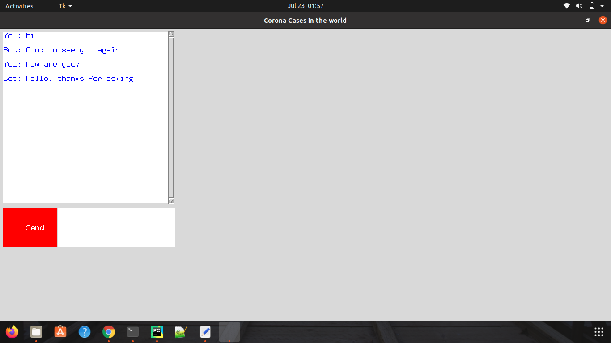
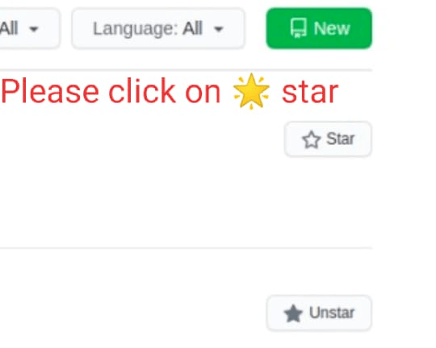

## Follow Me:

    

## Hi there 👋

# Corona Report Chatbot :
In this Chatbot, Just give the name of the country an d this chatbot will tell you about all the cases in that country.

### Library Installation :
 -  pip install -r requirements.txt 

### Train the Chatbot model :
 - python train_chatbot.py

### Run the Chatbot :
 - python chatgui.py
 

### Output :

## Please Star me on GitHub 
## Please follow me on GitHub

https://github.com/RakeshKumar045?tab=repositories

## Thank you for reaching out to me on Github. 

