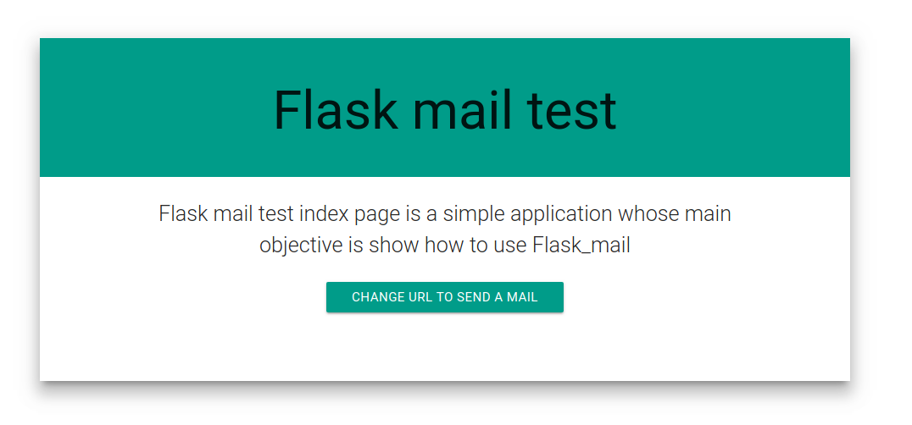
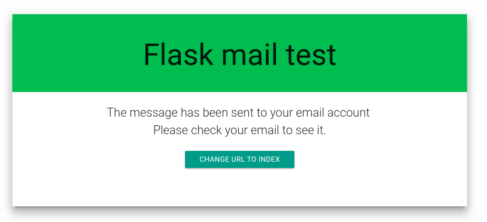
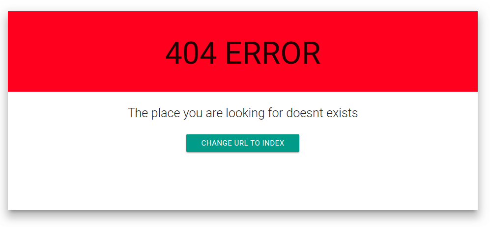

# flask-emails
The flask-emails extension is a simple way to send email messages from Flask application. It is a wrapper for python-emails.

### Features :
1) Email message abstraction with html and text part, with inline attachments, etc.

2) Email body template rendering

3) Email HTML body transform methods: css inlining, image inlining, etc.

4) SMTP backends

5) DKIM signature

6) Configured via Flask application config


#### Note : 
There are another flask extension Flask-Mail which solves almost same problems. I guess flask-emails solves little more problems.


# FlaskMail :
### How to Send Emails using Python


Let's write a few lines of Python code that will allow us to sent emails to 1000's of people at once just by running that python script.

##  💻 Lets pip First
We are going to use Flask and Flask-mail to do this. So open your command prompt & do.

`pip install -r requirements.txt`

### Code : 
You only need 3  easy steps for this:
#### 1. Create a Flask App
Let's start by creating a Flask app. 


We will be using mail variable to manage the features the instance "Mail" present in the [Flask-Mail](https://pythonhosted.org/Flask-Mail/) library.


#### 2. Add Your Details

#### 3. Compose & Send [Simple]


#### Run :
python mail.py

#### OR Run Jupyter file :
expose jupyter server : jupyter notebook 

#### 🍓 Compose & Send [Advanced]
By using .html instead of .body you can use different html tags and add .svg, .png too.  I am using  argument to add image using Url.


#### 🍓 Compose & Send [Pro]
Now that we know how add text & image. We can use different .html tags in combination with text and images to make it impressive like any other company Email. Also add <button> </button> redirecting users to your new websites.


## How can I Send Personalized Email to 1000's of Users?!
## Automate Mails
_(like)_ **Change User's Name** -  Use python to go through a .txt or excel document of your user base and parse through all the names one by one and replace it in the mail.


**!dea:** You can also change all the "he" to "she" or vice-versa depending on the gender.

## How can I Attach Files with the Mail ?!
### Attaching Files
Here we are attaching image.png file present in the same folder.
```
with app.open_resource("s2.png") as fp:
    msg.attach("s2.png", "image/png", fp.read())
```


#### Error , Please check below link
    1) https://stackoverflow.com/questions/16512592/login-credentials-not-working-with-gmail-smtp
2) https://myaccount.google.com/lesssecureapps

#### 💁 Keep in Mind
Since our code is not a full fledged app at this point, you may need to toggle your Gmail Setting.


***
### routes
* index
* * related info 
* send_mail
* * Send an email to respective recipients
***
### captures
#### Index

#### Success

#### Error

